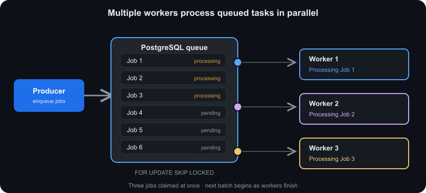

# PostgreSQL Queue POC

A small PostgreSQL-backed work queue using Node.js and Podman. It demonstrates concurrent consumers, `FOR UPDATE SKIP LOCKED`, retries, leases, and recovery after a worker stops.



The producer enqueues jobs in PostgreSQL. Workers claim jobs with `SKIP LOCKED`, process them, then save the completed or retry status. The dashboard displays queue and worker health.

## Requirements

- Podman
- Podman Compose
- A running Podman machine on macOS
- Node.js and npm for local commands

## Podman Compose demonstration

The Compose setup runs PostgreSQL, the monitoring dashboard, three workers, and a one-shot producer.

Install the Compose provider if needed:

```bash
brew install podman-compose
```

Start the complete demonstration:

```bash
./scripts/start-compose-demo.sh
```

Open [http://127.0.0.1:8090](http://127.0.0.1:8090) to view queue data and worker health. Follow service logs with:

```bash
podman compose logs -f worker monitor
```

The producer enqueues 20 jobs. Scale the workers up or down with:

```bash
podman compose up -d --scale worker=5 worker
```

Stop and remove the demonstration containers with:

```bash
./scripts/stop-compose-demo.sh
```

The PostgreSQL data remains in the `pg_queue_data` volume. Reset it with:

```bash
podman compose down --volumes --remove-orphans
```

## tmux demonstration

Start the Compose stack and open separate tmux panes for the producer, monitor logs, each worker, and live Prometheus metrics:

```bash
./scripts/start-tmux-demo.sh
```

Use a different worker count or session name with:

```bash
WORKER_COUNT=5 TMUX_SESSION=queue-demo ./scripts/start-tmux-demo.sh
```

Attach later with:

```bash
tmux attach -t pg-queue-demo
```

Use `TMUX_ATTACH=0` when starting from automation and attach manually later.

Shut down the tmux session, Compose services, and Podman machine:

```bash
./scripts/stop-tmux-demo.sh
```

Keep the Podman machine running with `STOP_PODMAN_MACHINE=0`.

## Start PostgreSQL locally

```bash
podman machine start
./scripts/start-postgres.sh
npm install
```

The script starts `docker.io/library/postgres:16` in a container named `pg-queue-postgres`, creates a persistent Podman volume, and initializes the schema from `db/init.sql`.

## Run the demo

Enqueue ten jobs:

```bash
npm run enqueue -- --count=10
```

Start two workers in separate terminals:

```bash
WORKER_ID=worker-a npm run worker
WORKER_ID=worker-b npm run worker
```

Inspect queue state:

```bash
npm run inspect
```

Workers process jobs with at-least-once semantics. Each claim has a lease, so a job can be reclaimed if its worker stops before completing it. The lease token prevents a stale worker from completing a job after another worker has reclaimed it.

## Demonstrate retries

The following jobs fail twice and succeed on the third attempt:

```bash
npm run enqueue -- --count=3 --fail-first=2 --max-attempts=3
WORKER_ID=retry-worker npm run worker -- --once
```

To demonstrate permanent failure, make jobs fail more times than their attempt limit:

```bash
npm run enqueue -- --count=2 --fail-first=5 --max-attempts=3
WORKER_ID=failure-worker npm run worker -- --once
```

## Demonstrate lease recovery

Use a short lease and a long workload:

```bash
QUEUE_LEASE_MS=3000 JOB_WORK_MS=10000 WORKER_ID=crash-worker npm run worker
```

Stop that worker with `Ctrl-C` after it claims a job. Start another worker after the lease expires:

```bash
QUEUE_LEASE_MS=3000 WORKER_ID=recovery-worker npm run worker
```

The abandoned job is reclaimed and processed again.

## Monitoring and observability

Start the local dashboard in another terminal:

```bash
npm run monitor
```

Open [http://127.0.0.1:8090](http://127.0.0.1:8090) to view:

- Job counts by status
- Recent job payloads, attempts, leases, and errors
- Worker process IDs, hostnames, health, current jobs, and result counts
- Automatic refreshes every two seconds

The monitor also exposes:

```text
GET /api/state
GET /metrics
GET /healthz
```

`/metrics` returns Prometheus-compatible gauges for job and worker counts. Worker heartbeats are stored in PostgreSQL every two seconds; a worker is shown as stale after six seconds without a heartbeat.

## Queue design

Jobs move through these states:

```text
pending -> processing -> completed
                  \-> pending  (retryable failure)
                  \-> failed   (attempt limit reached)
```

The worker claims jobs in a transaction using this pattern:

```sql
WITH next_job AS (
  SELECT id
  FROM jobs
  WHERE (status = 'pending' AND attempts < max_attempts)
     OR (status = 'processing' AND lease_until <= now() AND attempts < max_attempts)
  ORDER BY created_at, id
  FOR UPDATE SKIP LOCKED
  LIMIT 1
)
UPDATE jobs
SET status = 'processing',
    attempts = attempts + 1,
    lease_until = now() + interval '30 seconds'
FROM next_job
WHERE jobs.id = next_job.id
RETURNING jobs.*;
```

`SKIP LOCKED` lets multiple workers claim different rows without waiting on one another. Jobs use UUID lease tokens so an old worker cannot update a job after its lease has been reassigned.

## Configuration

| Variable | Default | Purpose |
| --- | --- | --- |
| `PGHOST` | `127.0.0.1` | PostgreSQL host |
| `PGPORT` | `5432` | PostgreSQL port |
| `PGDATABASE` | `queue_demo` | Database name |
| `PGUSER` | `queue` | Database user |
| `PGPASSWORD` | `queue` | Database password |
| `QUEUE_LEASE_MS` | `30000` | Job lease duration |
| `QUEUE_POLL_MS` | `500` | Empty queue polling interval |
| `JOB_WORK_MS` | `1000` | Simulated job duration |
| `MAX_JOBS` | `0` | Stop a bounded worker after this many claims; zero means no limit |
| `MONITOR_PORT` | `8090` | Monitoring dashboard port |

## Project layout

```text
.
├── Containerfile
├── compose.yaml
├── db/init.sql
├── package.json
├── scripts/start-compose-demo.sh
├── scripts/start-postgres.sh
├── scripts/start-tmux-demo.sh
├── scripts/stop-compose-demo.sh
├── scripts/stop-postgres.sh
├── scripts/stop-tmux-demo.sh
└── src
    ├── inspect.js
    ├── monitor.js
    ├── producer.js
    ├── queue.js
    └── worker.js
```

## Stop the demo

```bash
./scripts/stop-postgres.sh
podman machine stop
```

The database data remains in the `pg-queue-data` Podman volume. Remove it only when resetting the demo:

```bash
podman volume rm pg-queue-data
```

## Limitations

This is an at-least-once queue. A job can run more than once after a timeout, so real handlers must be idempotent or use deduplication. PostgreSQL is convenient when queue state and application data need one transaction, but a dedicated broker is usually better for very high throughput, large backlogs, or advanced delivery guarantees.
